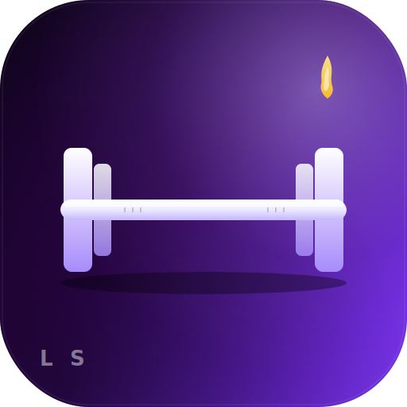

# 🔒☀️ LOCKED SUMMER

> App pessoal de treino, nutrição e progresso — **mobile-first, dark, locked in**.
> Privada, dois utilizadores fixos: **Emanuel** + **Tiago**.

Stack: **Vite + React 18 + TypeScript + Tailwind + Framer Motion + Recharts**.
DB: **Neon Postgres** (HTTP serverless driver).
Deploy: **GitHub Pages** via GitHub Actions.



---

## 🚀 Setup inicial (uma vez)

### 1. Criar projeto Neon

1. Vai a https://console.neon.tech → **New Project**
2. Nome `locked-summer`, região mais próxima (`AWS eu-central-1` por exemplo).
3. Em **Connection Details** copia o URL **pooled** (`postgres://…@…neon.tech/…?sslmode=require`).

### 2. Aplicar migrations no Neon

No SQL editor do Neon (ou via `psql`), corre **por esta ordem**:

```sql
-- 1) Schema
\i migrations/001_init.sql

-- 2) Seed alimentos default
\i migrations/002_seed.sql
```

(podes copiar e colar o conteúdo dos ficheiros directamente).

### 3. Criar utilizadores

Localmente, gera hashes para as duas passwords:

```bash
npm install
npm run hash-pw -- "PASSWORD_DO_EMANUEL"
# imprime: $2a$10$abcdef...
npm run hash-pw -- "PASSWORD_DO_TIAGO"
```

Depois, no SQL editor do Neon, edita `migrations/003_users.sql.example` substituindo
`$HASH_EMANUEL` e `$HASH_TIAGO` pelos hashes reais e corre o SQL.

### 4. Configurar GitHub Pages

```bash
gh api -X POST /repos/M4RQX/locked-summer/pages -f "build_type=workflow"
```

ou no UI: **Settings → Pages → Source: GitHub Actions**.

### 5. Adicionar secret no repo

```bash
gh secret set VITE_DATABASE_URL --body "postgres://...neon.tech/...?sslmode=require"
```

ou em **Settings → Secrets and variables → Actions → New repository secret**.

### 6. Push

```bash
git push origin main
```

O workflow `deploy.yml` faz build + deploy. URL final:
**https://m4rqx.github.io/locked-summer/**

---

## 🛠️ Desenvolvimento local

```bash
cp .env.example .env.local
# edita .env.local com o teu VITE_DATABASE_URL
npm install
npm run dev
```

Abre http://localhost:5173.

> **Nota:** o driver Neon serverless é HTTP, funciona no browser sem backend.
> A connection string fica embebida no bundle de produção — para 2 utilizadores
> privados está OK, mas se quiseres camada extra de segurança, mete um proxy
> (Cloudflare Workers, Vercel Functions) entre o front e o Neon.

---

## 📁 Estrutura

```
src/
  pages/           # Login, Dashboard, Workout, WorkoutSession, Food, Weight, Photos, Stats, Settings
  components/      # BottomNav, Header, ProgressBar, StatCard, EmptyState, Loading
  lib/
    db.ts          # Neon HTTP client
    auth.ts        # bcrypt login + localStorage session
    repo.ts        # Queries SQL tipadas (workouts, foods, meals, weights, photos, streak)
    plans.ts       # Plano de treino A/B/C estático
    quotes.ts      # Frases motivacionais (com easter egg)
    utils.ts       # date-fns helpers
  types/index.ts   # Domain types
migrations/        # 001_init.sql, 002_seed.sql, 003_users.sql.example
scripts/
  generate-icons.mjs   # SVG → PNG (prebuild)
  hash-password.mjs    # bcrypt CLI
public/
  favicon.svg
  icons/icon-192.png   # gerados pelo prebuild
  icons/icon-512.png
.github/workflows/deploy.yml  # CI/CD para GH Pages
```

---

## 🍔 Funcionalidades

- **Treino** — Dia A (peito+tríceps), Dia B (costas+bíceps+antebraço), Dia C (pernas+ombros+antebraço).
  Logging série a série, PR detection automático, histórico por exercício.
- **Comida** — base de alimentos pré-carregada (folhado, bitoque, mass gainer, etc).
  Botão **Shake LOCKED** — adiciona os 6 ingredientes do shake diário num clique.
  Custom foods, porções (0.5×, 1×, 1.5×, 2×, livre).
- **Peso** — gráfico Recharts, variação semanal/total/4-semanas, % até alvo.
- **Fotos** — frente/lado/costas, compressão client-side, comparação lado a lado.
- **Dashboard** — próximo treino, kcal hoje, peso, streak, frase motivacional, toggle do colega.
- **PWA** — instalável no homescreen, ícone, splash screen.
- **Mobile-first** — bottom nav 4 tabs, gestos, safe-area iOS.

---

## 🎨 Design

- Ink scale (`#050505 → #3a3a3a`) com acentos em **flame** (`#FF4500 → #FF8B5C`)
  e **gold** (`#FFB627`).
- Bebas Neue / Anton (display) + Inter (body) + JetBrains Mono (números).
- Framer Motion para transições de página, layoutId para indicador de tab activa.
- Bordas glow laranja em cards interactivos.

---

## 🤫 Easter egg

Procura "O Tiago é o maior" entre as frases motivacionais. 😄

---

## 🔐 Reset password

```bash
npm run hash-pw -- "nova password"
```

E no SQL editor do Neon:

```sql
update users set password_hash = '$2a$10$NOVO_HASH' where name = 'Emanuel';
```

---

**no days off · earn the summer 🔥**
